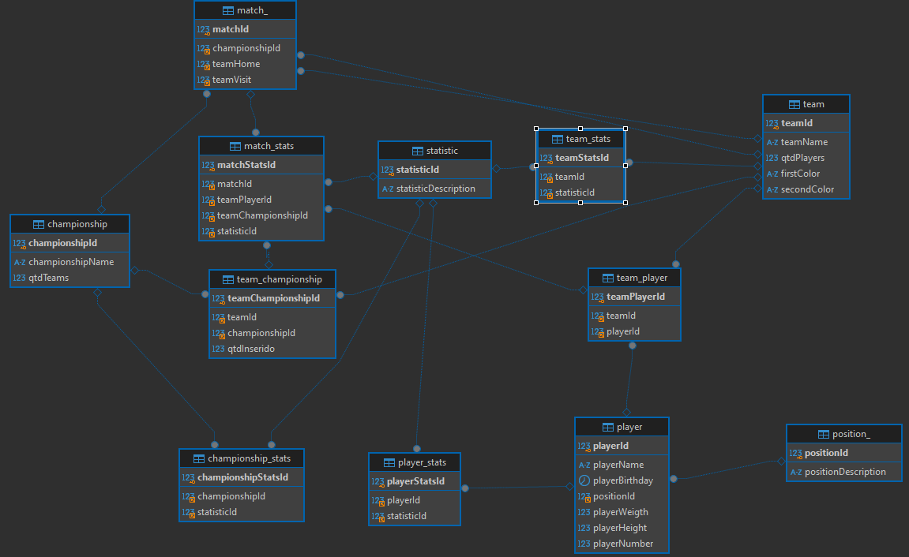

projeto de scout futebol amador

entidades:
estatistica: idEstatistica, estatisticaDescricao;
campeonato: idCampeonato, nomeCampeonato, qtdTimes, idTime;
jogador:  idTime, numeroJogador, nomeJogador, idadeJogador, alturaJogador, pesoJogador;
time: idTime, nomeTime, nomeCampeonato, qtdJogadores;
dadosJogos: idCampeonato, idTime, idJogador, idEstatistica;

Diagrama Entidade Relacionamento:
